# TurnDiff: Tunable-Generalization Diffusion Powered by Self-Supervised Contextual Sub-Data for Low-Dose CT Reconstruction
[](https://arxiv.org/abs/2509.23885)
[](https://opensource.org/licenses/MIT)
This repository contains the PyTorch implementation of the paper **"Tunable-Generalization Diffusion Powered by Self-Supervised Contextual Sub-Data for Low-Dose CT Reconstruction"**.
> **Code Availability:** The source code is available at [https://github.com/yqx7150/TurnDiff](https://github.com/yqx7150/TurnDiff).

## Abstract
Current models based on deep learning for low-dose CT denoising rely heavily on paired data and generalize poorly. Even the more concerned diffusion models need to learn the distribution of clean data for reconstruction, which is difficult to satisfy in medical clinical applications. At the same time, self-supervised-based methods face the challenge of significant degradation of generalizability of models pre-trained for the current dose to expand to other doses. To address these issues, this work proposes a novel method of TUnable-geneRalizatioN Diffusion (TurnDiff) powered by self-supervised contextual sub-data for low-dose CT reconstruction. Firstly, a contextual subdata self-enhancing similarity strategy is designed for denoising centered on the LDCT projection domain, which provides an initial prior for the subsequent progress.Subsequently, the initial prior is used to combine knowledge distillation with a deep combination of latent diffusion models for optimizing image details. The pre-trained model is used for inference reconstruction, and the pixel level self-correcting fusion technique is proposed for fine grained reconstruction of the image domain to enhance the image fidelity, using the initial prior and the LDCT image as a guide. In addition, the technique is flexibly applied to the generalization of upper and lower doses or even unseen doses. Dual-domain strategy cascade for self-supervised LDCT denoising, TurnDiff requires only LDCT projection domain data for training and testing. Comprehensive evaluation on both benchmark datasets and real-world data demonstrates that TurnDiff consistently outperforms state of-the-art methods in both reconstruction and generalization.

## Key Features

* **Contextual Sub-data Self-enhancing Similarity (CSSS):** Operates in the projection (sinogram) domain to mine self-supervised priors from noisy data, providing a robust initialization for the reconstruction process.
* **Tunable Generalization:** The model is designed to adapt to various dose levels (e.g., from $1\times 10^4$ to $1\times 10^5$ photons) without the need for extensive retraining on paired datasets.
* **Knowledge Distillation Diffusion:** Combines the generative power of Latent Diffusion Models (LDM) with the structural guidance of the CSSS-derived prior to hallucination-free reconstruction.
* **Pixel-level Self-correcting Fusion (PSF):** A dynamic fusion mechanism in the image domain that adaptively combines the diffusion output with the prior, correcting local deviations and preserving anatomical details.

## Related Work
<p align="center">
  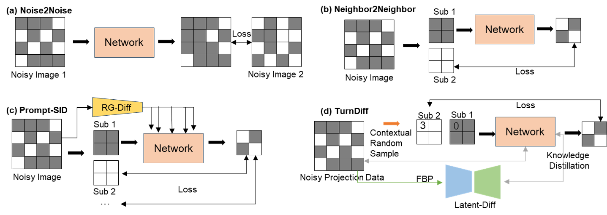
  <br>
  <em>Figure 1: Visual demonstration of the differences among (a) Noise2Noise, (b) Neighbor2Neighbor, (c) Prompt-SID and (d) TurnDiff.</em>
</p>

## Method Overview
<p align="center">
  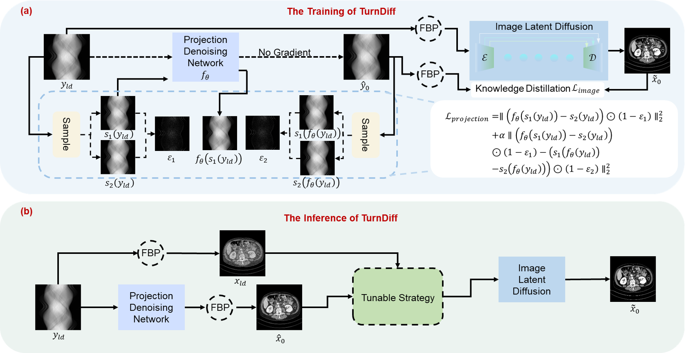
  <br>
  <em>Figure 2: General Architecture of TurnDiff Training and Inference. (a) The training of TurnDiff. (b) The inference of TurnDiff.</em>
</p
  
<p align="center">
  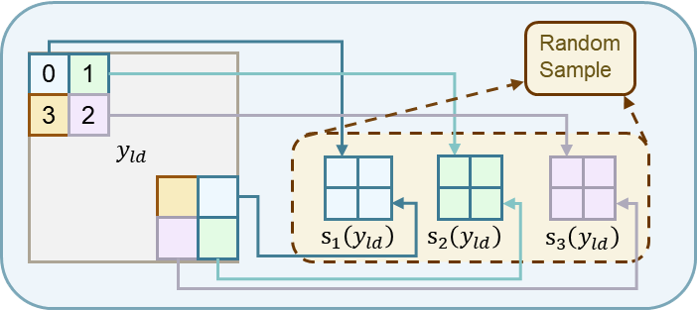
  <br>
  <em>Figure 3: Description of random sampling of contextual projection data.</em>
</p
  
<p align="center">
  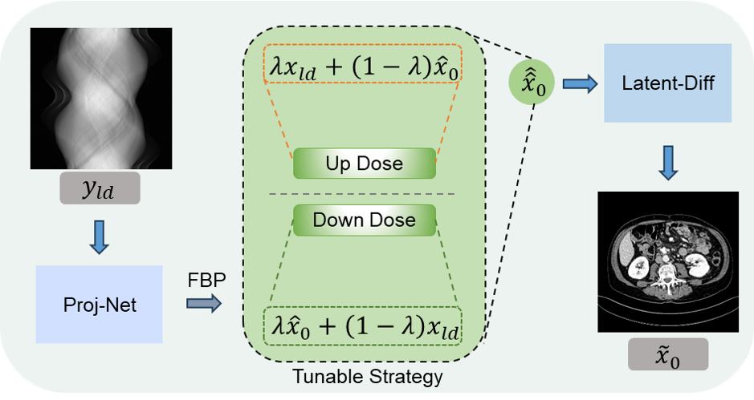
  <br>
  <em>Figure 4: unable up- and down-dose generalization strategy.</em>
</p
  
<p align="center">
  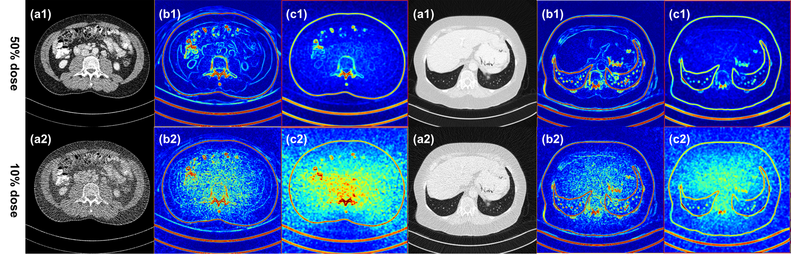
  <br>
  <em>Figure 5: {(a1), (a2)}: noisy images, {(b1), (b2)}: the edges extracted from x_0, and {(c1), (c2)}: the noise level estimated from x.</em>
</p

## Results
<p align="center">
  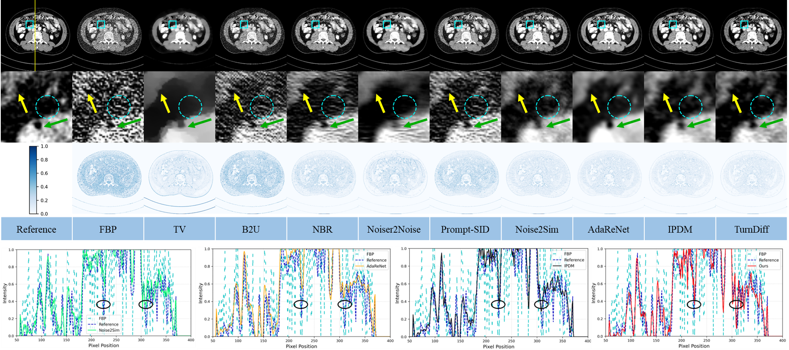
  <br>
  <em>Figure 6: Qualitative results of a 25% dose CT image from the Mayo dataset. Qualitative assessment against the Mayo 25% dose dataset in the abdomen. The line graphs show the fit of Noise2Sim, AdaReNet, IPDM, which are similar to the models in this study, to the reference in a column,
respectively. The display window is [-100,200] HU.</em>
</p

<p align="center">
  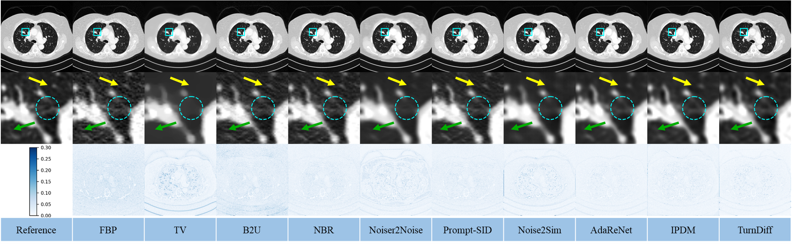
  <br>
  <em>Figure 7: Qualitative assessment in the lungs against the Mayo 25% dose dataset. The blue region of interest is zoomed in to show the difference,and the green and yellow arrows point to lesions with significant disparity. The display window is [-1350, 200] HU.</em>
</p

<p align="center">
  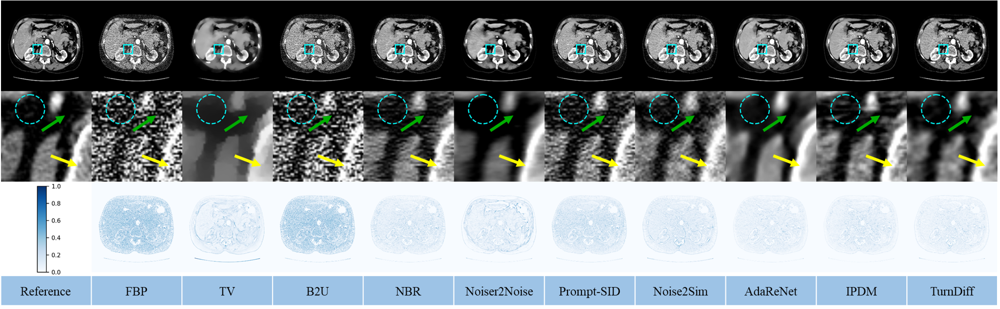
  <br>
  <em>Figure 8: Qualitative assessment against the LIDC-IDRI 25% dose dataset in the abdomen. The blue region of interest is zoomed in to show the difference, and the green and yellow arrows point to lesions with significant disparity. The display window is [-100,200].</em>
</p

<p align="center">
  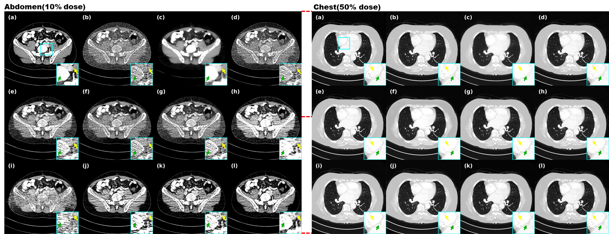
  <br>
  <em>Figure 9: Display of results on up and down dose generalization for (a)Reference (b) FBP (c) TV (d) B2U (e) NBR (f) Noiser2Noise (g) PromptSID (h) Noise2Sim (i) AdaReNet (j) IPDM (k) TurnDiff-Up/Down and (l)
TurnDiff (ours). The display window for abdomen images is [-100, 200]HU and for chest images is [-1350,200] HU</em>
</p

<p align="center">
  
  <br>
  <em>Figure 10: Generalized results from real clinical data. (a) FBP (b) TV (c) B2U (d) NBR (e) Noiser2Noise (f) Prompt-SID (g) Noise2Sim (h)
AdaReNet (i) IPDM (j) TurnDiff (ours). The display window is [-100, 200]HU.</em>
</p

<p align="center">
  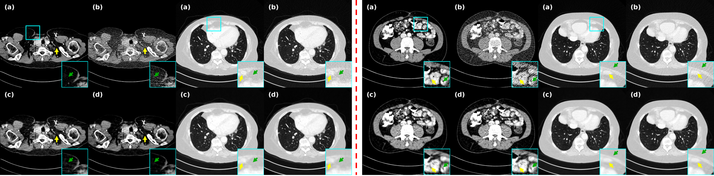
  <br>
  <em>Figure 11: Ablation studies to verify the effectiveness of two-stage and the importance of similarity enhancement perception. Left: (a) Reference (b)FBP (c) Only projection (d) TurnDiff (ours). Right: (a) Reference (b) FBP
(c) No enhance (d) TurnDiff (ours). The display window for abdomen images is [-100, 200] HU and for chest images is [-1350,200] HU.</em>
</p

<p align="center">
  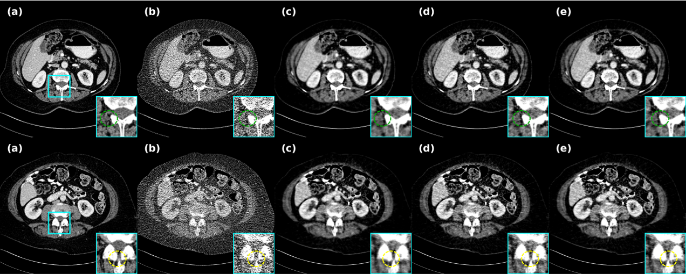
  <br>
  <em>Figure 12: Ablation studies on the effectiveness of pixel-level weighted fusion. (a) Reference (b) FBP (c) λ = 0.5 (d) λ = 1 (e) TurnDiff(ours). The display window for abdomen images is [-100, 200] HU.</em>
</p


## Citation
```bibtex
If you use this code or find our work useful, please cite:
@article{wei2025turndiff,
  title={Tunable-Generalization Diffusion Powered by Self-Supervised Contextual Sub-Data for Low-Dose CT Reconstruction},
  author={Wei, Guoquan and Shi, Liu and Zhou, Zekun and Shan, Wenzhe and Liu, Qiegen},
  journal={arXiv preprint arXiv:2509.23885},
  year={2025}
}


